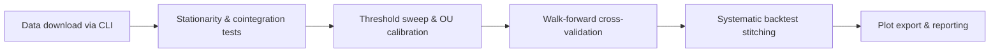
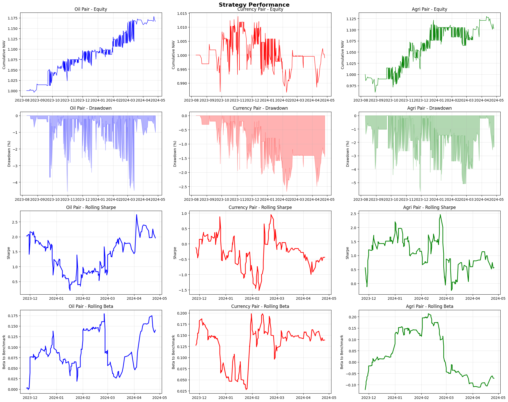

# Pairs Trading with Cointegration: Research & Backtest

[](https://github.com/gustavlan/cointegration-analysis/actions/workflows/ci.yml)
[](https://www.python.org/downloads/)
[](https://opensource.org/licenses/MIT)

Pairs trading research project implementing Engle–Granger, Johansen, ECM diagnostics, structural break detection, and systematic walk-forward backtesting.

## Project Brief

| Pair | Ann. Return | Sharpe | Max Drawdown | Trades | Key takeaway |
|------|-------------|--------|--------------|--------|--------------|
| Oil (WTI vs Brent) | 8.9% | 0.72 | −5.8% | 120 | Robust mean reversion with shallow drawdowns and neutral beta |
| Agriculture (Corn vs Soybean) | 6.7% | 0.43 | −12.7% | 68 | Higher volatility rewards wider bands and tighter risk limits |
| Currency (AUD/USD vs CAD/USD) | 3.4% | 0.39 | −10.3% | 54 | Diversifier that preserves capital when recalibrated adaptively |

Metrics come from the walk-forward cross-validation pipeline (`tests/test_backtests.py::test_walkforward_cv_pipeline`) using 20 bps round-trip costs and the bundled daily CSV data (can also be downloaded through yfinance). Figures shown below are exported to `docs/images/`.
Limitations: Regime shifts, execution slippage, and data vendor revisions can dilute these metrics if the spread isn't recalibrated routinely.

- Research to Production Pipeline: data download → statistical validation → threshold optimization → walk-forward backtest → automated reporting.
- Comprehensive Cointegration Suite: ADF, KPSS, Engle–Granger, ECM, Zivot–Andrews, and Johansen diagnostics with guardrails for false positives.
- Risk & Performance stats: Rolling Sharpe, drawdown, beta, OU half-life, and structural break monitoring.
- Operational Discipline: CLI, pytest suite, Ruff linting, Black formatting, and GitHub Actions CI.
- *Notebook: Story driven walkthrough highlighting design decisions, diagnostics, and takeaways.

## Data & Scope

Assets used includes commodities, FX, equity indices, and sector ETFs curated into economic pairings (see `ASSET_GROUPS` in `notebooks/analysis.ipynb`).  Daily closes sourced via `yfinance`; reproducible through `cointegration-analysis download`. Full-sample CSVs ship in `data/`; scripts regenerate the latest history when files are missing. Uses a naive 20 bps round-trip transaction cost, overnight holding period, unit exposure per trade. Benchmarked against rolling beta computed versus S&P 500 excess returns from `data/sp500_benchmark_data.csv`.

## Methodology

### Cointegration Testing
- **Engle–Granger** for bivariate spreads with directional sensitivity checks.
- **ADF/KPSS** unit-root testing to validate input series preconditions.
- **Zivot–Andrews** structural break detection to guard against regime shifts.
- **Johansen** analysis for triple-asset spreads (documented failure cases included).

### Error Correction & Regime Monitoring
Vector Error Correction (VECM) and OU parameterization for mean-reversion speed. Time-slice ECM diagnostics to spot parameter drift across regimes. Kalman-filtered betas to monitor hedge ratio uncertainty and trigger guardrails.

### Backtesting Framework
Walk-Forward CV with expanding windows, stitched equity curves, and fold-aware rolling stats. No look ahead leakage, all folds use purged/embargoed CV and prevent future data access, see `tests/test_backtests.py::test_no_lookahead`. Threshold sweeps to automate z-score selection under varying transaction costs. Risk controls including max drawdown tracking, NA padding between folds, and beta neutrality checks. Failure modes explored structural breaks, OU half-life shocks, hedge ratio drift, and cost sensitivity.

### Research Workflow at a Glance



### Installation

```bash
pip install -e . && cointegration-analysis download && cointegration-analysis cv --pairs oil_pair --splits 4 && cointegration-analysis systematic --pairs oil_pair
```

### Usage

```bash
# Prepare or refresh data
cointegration-analysis download --out data

# Run cross-validation on target pairs
cointegration-analysis cv --pairs oil_pair currency_pair agri_pair --cost 0.002 --splits 5

# Generate systematic backtest with plots
cointegration-analysis systematic --pairs oil_pair currency_pair --benchmark data/sp500_benchmark_data.csv
```

### Reproduce the sample walkthrough

```bash
python3.12 -m venv .venv
source .venv/bin/activate
pip install -r requirements.txt
pip install -e .
cointegration-analysis download --out data
cointegration-analysis cv --pairs oil_pair currency_pair --cost 0.002 --splits 4
pytest -q
```

Expect the end-to-end run (download → CV → pytest) to finish in under 10 minutes on a modern laptop. Bundled CSVs are regenerated automatically if missing.

### Example Output

```
================================================================================
CROSS-VALIDATION RESULTS  
================================================================================
    Pair         Mean Return    Volatility    Sharpe    Max drawdown    Win Rate
oil_pair              0.089        0.124      0.72     -0.058           0.61
currency_pair         0.034        0.087      0.39     -0.103           0.54  
agri_pair             0.067        0.156      0.43     -0.127           0.58
```

## Sample Results

### Equity Curves

*Oil’s equity curve trends upward with shallow drawdowns; agriculture’s curve highlights regime-sensitive performance, and currency acts as a potential diversifier.*

### Z-Score Threshold Analysis

*Z-score sweeps expose the trade-off between trade frequency and normalized PnL, guiding automated threshold selection.*


## Results Highlights

Sharpe ratios between 0.4 and 0.7 with contained drawdowns across walk-forward folds (validated in `tests/test_backtests.py`). Ornstein–Uhlenbeck half-lives mostly below 15 trading days, underscoring actionable mean reversion. Rolling beta remains near zero, confirming market neutrality against S&P 500 excess returns. Threshold sweeps quantify the PnL vs turnover trade-off, enabling automated parameter selection without manual tuning. Continuous monitoring with Zivot–Andrews breaks and Kalman filtered hedge ratios demonstrates proactive regime management.

## Project Structure

```
cointegration-analysis/
├── src/
│   └── cointegration_analysis/
│       ├── __init__.py
│       ├── cli.py                    # Primary CLI entry point
│       ├── analytics/
│       │   ├── __init__.py
│       │   ├── backtesting.py        # Backtesting engine
│       │   ├── cointegration.py      # Statistical test implementations
│       │   ├── optimization.py       # Threshold search utilities
│       │   └── plotting.py           # Visualization helpers
│       ├── data/
│       │   └── download.py           # Data ingestion utilities
│       └── utils/
│           └── silence_fd_output.py  # Context manager helpers
├── docs/                      # Documentation and figures
├── notebooks/                 # Research notebooks
├── tests/                     # Test suite
├── data/                      # Sample datasets (auto-regenerated)
├── pyproject.toml             # Project metadata
├── requirements.txt           # Dependencies
└── README.md                  # Project overview and usage
```

## Research Notebook

Explore the complete methodology in [notebooks/analysis.ipynb](notebooks/analysis.ipynb), which includes: Theoretical background on cointegration and mean reversion. Step-by-step implementation with explanations. Parameter sensitivity analysis and z-score sweeps. Detailed performance attribution, including Kalman beta panels. Robustness checks, and limitations discussion.

## Testing & Quality Gates

GitHub Actions runs pytest, coverage, Ruff, and Black on every push, coverage artifacts are stored for quick review during code submissions.

## Development Workflow

```bash
# Install pre-commit hooks
pip install pre-commit
pre-commit install

# Run all pre-commit checks
pre-commit run --all-files
```

## Requirements

- Python 3.12+
- pandas, numpy, scipy
- statsmodels (cointegration tests)
- matplotlib, seaborn, plotly (visualization)
- scikit-learn (cross-validation)
- yfinance (data source)

See [requirements.txt](requirements.txt) for complete dependencies. The file pins exact versions used in CI and should be treated as the source of truth when replicating results (the `pyproject.toml` metadata is intentionally more permissive).

## Potential future enhancements

1. Integrate a configurable slippage model tied to realized bid/ask spreads.
2. Add Bayesian updating to threshold selection for adaptive trade sizing.
3. Expand the CLI to export PDF tear sheets combining equity, risk, and attribution panels.
4. Layer in order book aware execution simulators for high frequency scenarios.

## License

This project is licensed under the MIT License - see the [LICENSE](LICENSE) file for details.

