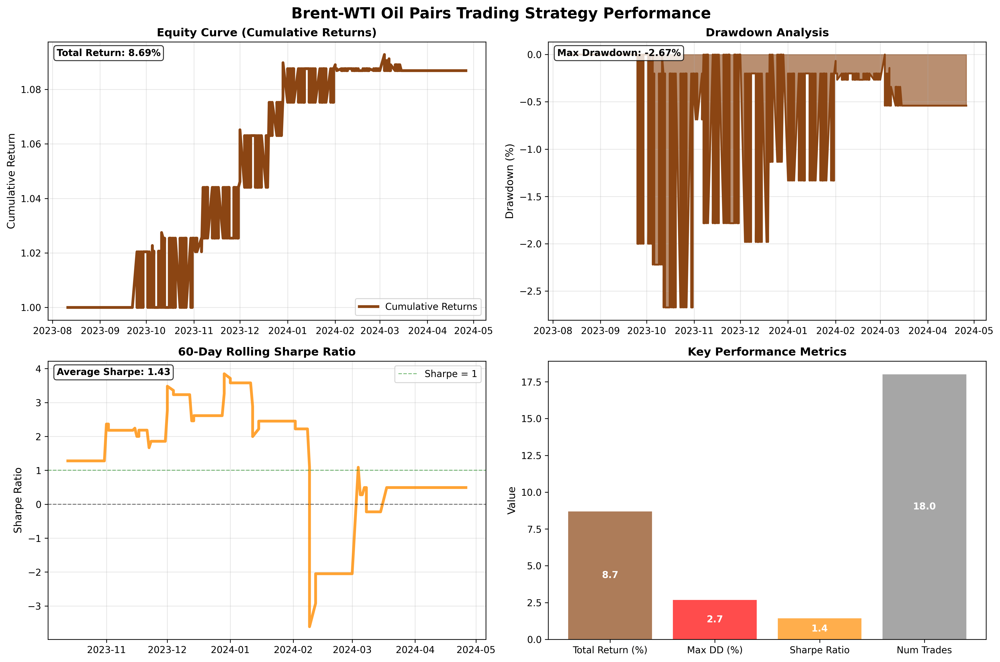
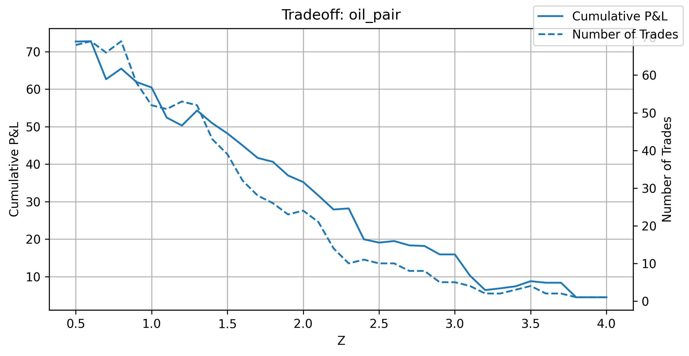

# Pairs Trading with Cointegration: Research & Backtest

[](https://github.com/gustavlan/cointegration-analysis/actions/workflows/ci.yml)
[](https://www.python.org/downloads/)
[](https://opensource.org/licenses/MIT)

Pairs trading research project implementing multiple cointegration methodologies including Engle–Granger tests, Error Correction Models (ECM), structural break detection via Zivot–Andrews tests, Johansen cointegration for multiple series, and systematic backtesting with walk-forward cross-validation.

## 🎯 Features

- **Comprehensive Cointegration Toolkit**: ADF, KPSS, Engle–Granger, ECM, Zivot–Andrews, and Johansen tests
- **Advanced Backtesting**: Walk-forward CV with systematic result stitching
- **Threshold Optimization**: Z-score parameter sweeps for optimal entry/exit levels
- **Visualization**: Equity curves, drawdowns, rolling metrics, and statistical plots
- **Production-Ready**: CLI interface, comprehensive testing, and CI/CD pipeline
- **Research Notebook**: Walkthrough of methodology and results

## 📊 Methodology

### Cointegration Testing
- **Engle-Granger**: Two-step procedure for bivariate cointegration
- **Augmented Dickey-Fuller (ADF)**: Unit root testing for stationarity
- **KPSS Test**: Complementary stationarity testing (opposite of ADF)
- **Zivot-Andrews**: Structural break detection in cointegration relationships
- **Johansen**: Multivariate cointegration analysis for asset triplets

### Error Correction Models
- **Vector Error Correction (VECM)**: Capture short-run dynamics
- **Rolling ECM Analysis**: Time-varying cointegration strength
- **Speed of Adjustment**: Mean-reversion parameter estimation

### Backtesting Framework
- **Walk-Forward CV**: Out-of-sample validation with expanding windows
- **Transaction Costs**: Simply fixed assumption
- **Risk Management**: Position sizing and maximum drawdown controls
- **Performance Attribution**: Sharpe ratios, beta analysis, and risk-adjusted returns

## 🚀 Quick Start

### Installation

```bash
# Clone the repository
git clone https://github.com/gustavlan/pairs-cointegration-backtester.git
cd pairs-cointegration-backtester

# Create virtual environment
python3.12 -m venv .venv
source .venv/bin/activate  # On Windows: .venv\\Scripts\\activate

# Install dependencies
pip install -r requirements.txt
```

### Basic Usage

```bash
# Prepare data directory
python main.py download --out data

# Run cross-validation on pairs
python main.py cv --pairs oil_pair currency_pair agri_pair --cost 0.002 --splits 5

# Generate systematic backtest with plots
python main.py systematic --pairs oil_pair currency_pair --benchmark data/sp500_benchmark_data.csv
```

### Example Output

```
================================================================================
CROSS-VALIDATION RESULTS  
================================================================================
    Pair         Mean Return    Volatility    Sharpe    Max DD    Win Rate
oil_pair              0.089        0.124      0.72     -0.058       0.61
currency_pair         0.034        0.087      0.39     -0.103       0.54  
agri_pair             0.067        0.156      0.43     -0.127       0.58
```

## 📈 Sample Results

### Equity Curves


### Rolling Performance Metrics


### Z-Score Threshold Analysis


*Note: Results are for research purposes only and do not constitute investment advice.*

## 🏗️ Project Structure

```
pairs-cointegration-backtester/
├── main.py                 # CLI entry point
├── cointegration_tests.py  # Core statistical tests
├── backtests.py           # Backtesting engine
├── plotting.py            # Visualization utilities  
├── threshold_optimization.py # Parameter tuning
├── data_download.py       # Data management
├── notebooks/             # Research notebooks
│   └── analysis.ipynb     # Complete methodology walkthrough
├── tests/                 # Test suite
├── docs/                  # Documentation and figures
├── data/                  # Sample datasets
└── requirements.txt       # Dependencies
```

## 🔬 Research Notebook

Explore the complete methodology in our [Jupyter notebook](notebooks/analysis.ipynb), which includes:

- Theoretical background on cointegration
- Step-by-step implementation of statistical tests
- Parameter sensitivity analysis
- Detailed performance attribution
- Robustness checks and limitations

## 🧪 Testing

```bash
# Run full test suite
pytest -v

# With coverage report  
pytest --cov=. --cov-report=html

# Lint and format
ruff check .
black .
```

## 🔄 Development Workflow

```bash
# Install pre-commit hooks
pip install pre-commit
pre-commit install

# Run all pre-commit checks
pre-commit run --all-files
```

## 📋 Requirements

- Python 3.12+
- pandas, numpy, scipy
- statsmodels (cointegration tests)
- matplotlib, seaborn, plotly (visualization)
- scikit-learn (cross-validation)
- yfinance (data source)

See [requirements.txt](requirements.txt) for complete dependencies.

## ⚠️ Disclaimer

This project is for educational and research purposes only. Past performance does not guarantee future results. Trading involves substantial risk and may not be suitable for all investors.

## 📄 License

This project is licensed under the MIT License - see the [LICENSE](LICENSE) file for details.

## 📧 Contact

Gustav Lantz - [@gustavlan](https://github.com/gustavlan)

Project Link: [https://github.com/gustavlan/pairs-cointegration-backtester](https://github.com/gustavlan/pairs-cointegration-backtester)
